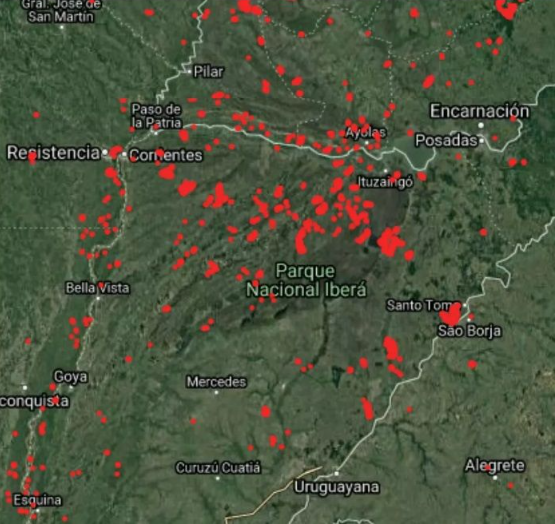
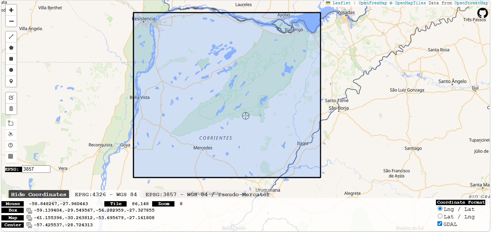
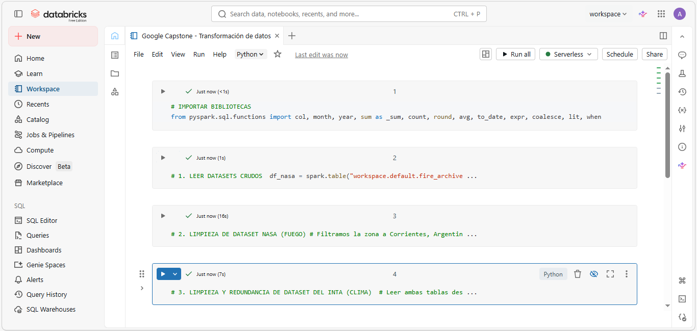
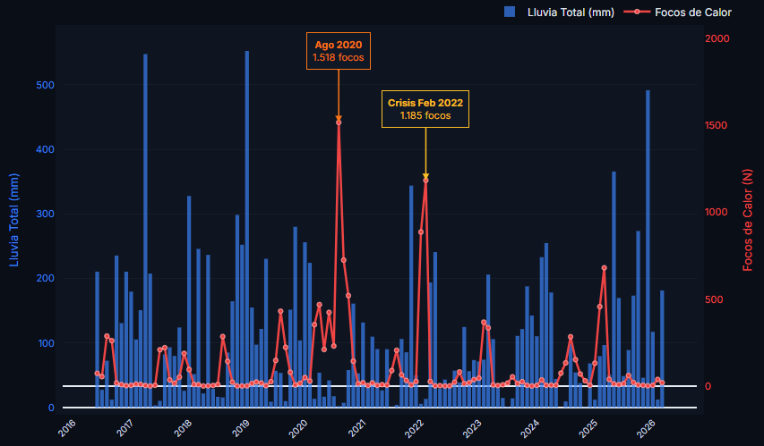
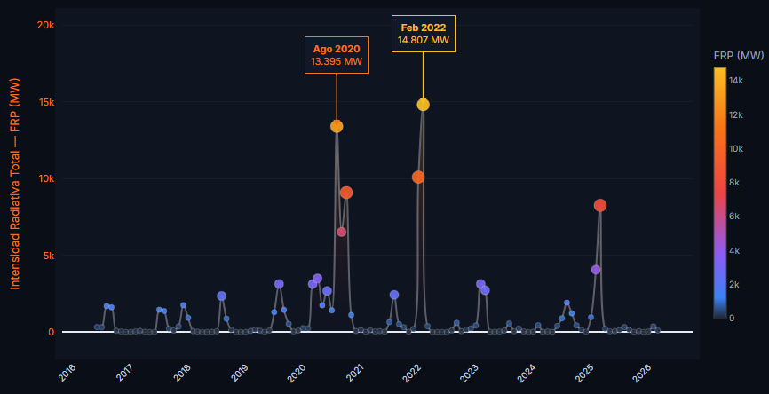
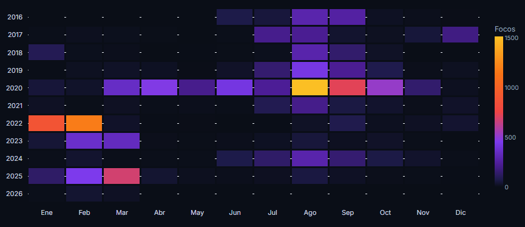
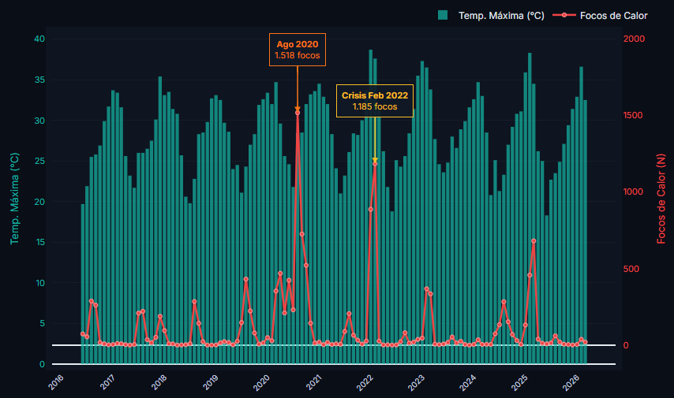
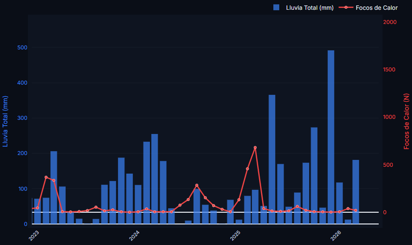

# Documentación del Proyecto de Análisis: Impacto Climático y Focos de Calor en Corrientes

## Introducción y Móvil del Análisis

Durante el primer trimestre de 2022, la provincia de Corrientes atravesó una de las crisis ambientales, económicas y operativas más severas de su historia reciente. En un contexto marcado por una sequía extrema prolongada y la bajante histórica del río Paraná, los incendios forestales y rurales consumieron, hacia fines de febrero de ese año, más de 1.000.000 hectáreas. La magnitud de la catástrofe se evidenció en un ritmo de progresión del fuego que alcanzó las 30.000 hectáreas diarias, desbordando las capacidades logísticas tradicionales y requiriendo un despliegue sin precedentes de brigadistas, aeronaves y recursos nacionales y locales.

  
   
  <em><a href="https://www.lapatriadaweb.com.ar/corrientes-el-mapa-de-los-incendios/" target="_blank">La Patriada Web | Mapa de incendios de la provincia de Corrientes en el periodo 2021 - 2022</a></em>

Este evento expuso la profunda vulnerabilidad de nuestro territorio ante la combinación de factores climáticos adversos y la falta de un seguimiento de los mismos. El impacto amenazó a la matriz productiva y a la biodiversidad, afectando severamente a la Reserva Provincial del Iberá —el segundo humedal más grande del mundo— y a especies autóctonas en peligro de extinción.

  
   
  <em>Archivo Periodístico | Devastación durante los megaincendios de Corrientes (2022)</em>

Este proyecto nace como una iniciativa para estructurar, limpiar y cruzar volúmenes masivos de datos históricos provenientes de satélites de la NASA y sensores terrestres del INTA. El móvil principal de este análisis es demostrar empíricamente las correlaciones entre los factores climáticos y la ignición territorial, concientizando al gobierno de Corrientes que un dataset validado e íntegro que permita identificar patrones históricos puede evitar catástrofes.

---

## Fases del Proyecto

### 1. Fase de Definición (ASK)

* **Identificación de la tarea:** El objetivo principal radicó en analizar y cuantificar la relación histórica entre las variables meteorológicas (escasez de precipitaciones, temperaturas máximas) y la propagación de incendios forestales en la región norte de la Provincia de Corrientes durante la última década (2016-2026), con especial énfasis en las anomalías del período 2020-2022.
* **Determinación de los Interesados:** El análisis está diseñado para aportar valor a entidades gubernamentales, organismos de respuesta a emergencias, el sector agrónomo y organizaciones de conservación ambiental que requieran optimizar sus sistemas de alerta temprana.
* **Selección del Conjunto de Datos:** Se seleccionaron datos satelitales de anomalías térmicas provistos por la NASA (satélites VIIRS y MODIS) y registros meteorológicos históricos del Instituto Nacional de Tecnología Agropecuaria (INTA).
* **Establecimiento de Métricas Clave:** Las métricas seleccionadas para el seguimiento del objetivo fueron: Volumen de Precipitaciones Mensuales (mm), Temperatura Máxima Promedio Mensual (°C), Frecuencia de Focos de Calor (N°) e Intensidad Radiativa del Fuego (FRP).

### 2. Fase de Preparación (PREPARE)

* **Descarga y Almacenamiento:** Los volúmenes de datos brutos (archivos CSV masivos de los sitios de la NASA y el INTA) fueron descargados de sus portales oficiales y alojados de manera segura en el entorno Cloud de Databricks.
* **Clasificación y Filtrado Geospacial:** Se aplicó un Bounding Box para aislar geográficamente los incidentes ocurridos exclusivamente en el norte de Corrientes, garantizando el aislamiento espacial del área de estudio.

  
   
  <em>Captura de Bbox, de aquí surgieron los límites geográficos para especificar la zona de estudio</em>

* **Evaluación de la Credibilidad del Dato:** Se garantizó la calidad bajo el marco ROCCC. Se identificaron y documentaron sesgos físicos en la recolección, tales como la ceguera satelital por cobertura de nubes (Cumulonimbus) y la falla de sensores pluviométricos en tierra en meses específicos. Referencias: 
    * <em><a href="https://firms.modaps.eosdis.nasa.gov/download/" target="_blank">NASA FIRMS: Archive Download</a></em>
    * <em><a href="https://siga.inta.gob.ar/#/data" target="_blank">INTA: Datos (actuales e históricos)</a></em>

### 3. Fase de Procesamiento (PROCESS)

* **Elección de Herramientas Tecnológicas:** Se seleccionó el entorno de Databricks utilizando el lenguaje PySpark debido a la necesidad de procesar Big Data. Se eligió además Streamlit para realizar los gráficos.
* **Auditoría y Detección de Errores:** Se detectaron: tipos de datos inconsistentes (texto en columnas numéricas), valores nulos por fallas de sensores climáticos y "falsos ceros" temporales por la ausencia de filas en meses sin detecciones.
* **Transformación y Limpieza:**
  * **Filtro de Confianza:** Se aislaron exclusivamente los focos de calor sobre la vegetación, descartando reflejos solares y anomalías industriales mediante filtros de confianza satelital.
  * **Imputación de Faltantes:** Se desarrolló un algoritmo de imputación que detectó los días con sensores rotos en una estación y reemplazó automáticamente los vacíos con datos de otra estación de respaldo.
  * **Documentación del Código:** El proceso de limpieza (ETL) fue documentado y segmentado en un notebook de Databricks garantizando la trazabilidad de los datos.

  
   
  <em>Captura de la Plataforma Cloud de Databricks, donde se muestra el trabajo de cómputo en ejecución</em>

### 4. Fase de Análisis (ANALYZE)

* **Agregación y Consolidación de Datos:** Se aplicaron funciones de agregación espacial y temporal reduciendo cientos de miles de registros crudos a una "Tabla Analítica Final" de alta densidad informativa y bajo peso computacional (una fila por mes exacto).
* **Organización y Formateo:** La tabla resultante fue estructurada bajo convenciones estándar de tipado (Enteros para conteos, Flotantes decimales para precipitaciones y temperatura), preparada para su ingesta en software de Inteligencia de Negocios.
* **Ejecución de Cálculos y Relleno de Vacíos:** Se realizaron operaciones de suma total para lluvias y FRP, y cálculos de promedios para temperaturas, forzando matemáticamente los campos nulos a 0 para mantener la integridad de los gráficos de series de tiempo.
* **Identificación Temprana de Tendencias y Hallazgos:** Durante la revisión tabular se realizó un pequeño EDA (Análisis de Datos Exploratorio) en donde se identificaron relaciones complejas que enriquecen el análisis:
  * **Latencia del Suelo:** Se comprobó que meses de sequía severa no generan incendios inmediatos si están precedidos por meses de alta saturación hídrica.
  * **Agotamiento de Biomasa:** Se identificó una reducción significativa de focos de calor post-crisis 2022 a pesar de condiciones climáticas favorables para incendios, validando el impacto de la ausencia de combustible biológico.

## 5. Presentación de Resultados y Conclusiones (SHARE)

Los datos revelaron la verdadera naturaleza de las crisis ambientales en la provincia de Corrientes. La visualización de estas métricas desmiente creencias populares y expone la urgente necesidad de implementar herramientas de ciencia de datos en la gestión pública para la toma de decisiones.

#### La Trampa de la Cantidad vs. la Devastación Real (2020 vs. 2022)

Al observar un simple conteo de focos de calor, el año 2020 (específicamente el mes de agosto, con 1.518 focos) parece ser el pico máximo de la década. Sin embargo, un análisis profundo incorporando la Intensidad Radiativa (FRP) nos dice que la verdadera catástrofe ocurrió en el primer trimestre de 2022.

  
   
  <em>Gráfico general de Lluvia total vs. Focos de Calor (2016-2026): Evidencia la "trampa de la cantidad" con el pico máximo de focos en agosto de 2020, comparado con la sequía extrema de 2022.</em>

* **2020 - El inicio de la sequía y el factor humano:** Durante el invierno de 2020, el fenómeno de La Niña recién comenzaba a secar la capa superficial del suelo. La gran cantidad de focos se debió principalmente a la tradicional quema de pastizales intencionada para la ganadería y siembra, una práctica que se salió de control. Las estadísticas señalan que el 95% de los incendios son intencionales. Aunque la intensidad general de energía liberada fue menor en comparación a 2022, el daño ecológico a nivel local fue masivo; por ejemplo, el Parque Provincial San Cayetano perdió el 90% de su superficie y casi el 100% de su fauna debido a estas quemas [1].
* **2022 - Los Megaincendios:** La crisis de febrero de 2022 (1.185 focos) fue infinitamente más devastadora. Impulsada por la sequía acumulada de dos años ininterrumpidos de La Niña, temperaturas estivales extremas y la negligencia humana (por falta de concientización), el fuego alcanzó una virulencia incontrolable. En este período, la cobertura vegetal afectada alcanzó el 11% de la superficie total de Corrientes. El fuego penetró en el corazón de los Esteros del Iberá, el segundo humedal más importante de Sudamérica. Esto provocó una destrucción masiva de biodiversidad y puso en grave amenaza a especies vulnerables como el aguará guazú, el ciervo de los pantanos y diversas especies de anfibios y aves [2].

  
   
  <em>Intensidad Radiativa Total (FRP): Esta métrica de energía revela la verdadera magnitud destructiva. La crisis de febrero de 2022 liberó una energía sin precedentes (14.807 MW), superando en gravedad ecológica a los eventos de 2020.</em>

#### El Desplazamiento Estacional: Cuando el ecosistema colapsa

El mapa de calor histórico y el cruce con temperaturas máximas revelan un comportamiento anómalo fundamental que explica la tragedia de 2022 y la importancia de PREVENIR.

Históricamente (2016-2019), la temporada alta de incendios en Corrientes ocurre en agosto y septiembre. En esta época no existen calores abrasadores (los promedios rondan los 24°C a 26°C); el fuego es impulsado por las heladas invernales que secan el pasto y por la alta actividad antrópica. El calor extremo del verano correntino rara vez causaba incendios graves porque los humedales funcionaban como un cortafuegos natural gracias a las lluvias estivales (Efecto Esponja).

Sin embargo, el gráfico evidencia que en 2022 este patrón se rompió por completo: la alta concentración de fuego se desplazó al pleno verano (enero-febrero). La falta de herramientas de análisis predictivo impidió a las autoridades notar a tiempo impacto producido anteriormente en 2020 y los meses de sequía (los humedales habían perdido su capacidad de retención hídrica), permitiendo que el ecosistema ardiera con facilidad a más de 40°C.

  
   
  <em>Mapa de calor mensual (2016-2026): Muestra de forma contundente la anomalía del año 2022, rompiendo el patrón histórico de quemas de agosto/septiembre y desplazando el peligro crítico a los meses de pleno verano (enero y febrero).</em>

  
   
  <em>Temperatura Máxima vs. Focos de Calor: Ilustra cómo en 2022 el colapso del "efecto esponja" del humedal permitió que el fuego se combinara fatalmente con temperaturas extremas que superaban los 35°C, situación que no producía incendios en años húmedos previos.</em>

#### El Caso de Marzo 2025: Incendios sin Megadevastación

El dataset registra un nuevo pico de focos de calor hacia el final del período analizado, específicamente en marzo de 2025 (681 focos). No obstante, al analizar su métrica de FRP, la intensidad fue notablemente inferior a la crisis de 2022.

Se puede explicar este fenómeno mediante dos factores clave:

* **El Efecto Esponja Residual:** A diferencia del escenario previo a 2022, el año 2025 estuvo antecedido por el ciclo lluvioso de "El Niño" (2023-2024), el cual logró recargar las napas y humedales profundos. Estas reservas hídricas impidieron que el fuego penetrara en la tierra y causara daños estructurales severos en el ecosistema.
* **Agotamiento de Biomasa:** Los megaincendios de 2022 consumieron gran parte del combustible pesado. Por lo tanto, los incendios de 2025 —detonados nuevamente por la imprudencia humana durante una ventana seca— fueron mayormente fuegos superficiales de pasturas de rápida combustión, incapaces de sostener la energía radiativa destructiva observada años atrás.

  
   
  <em>Detalle del período 2023-2026: Refleja el ciclo lluvioso previo que recargó los ecosistemas ("Efecto Esponja Residual"), lo cual amortiguó la severidad del nuevo repunte de focos superficiales en marzo de 2025.</em>

#### Conclusión y Llamado a la Acción

La crisis de incendios en Corrientes no es un evento impredecible de la naturaleza, sino el resultado de una fórmula climática y social claramente evidenciada en este análisis: Sequía Acumulada + Altas Temperaturas + Imprudencia Humana.

El mayor hallazgo de este proyecto es que los megaincendios y las condiciones para su propagación pueden ser pronosticados con meses de anticipación. La falta de herramientas de ciencia de datos y de equipos de análisis continuo en la gestión pública ha provocado que históricamente se reaccione al fuego cuando este ya es incontrolable.

Para evitar futuros ecocidios y proteger la matriz productiva y natural de la provincia, es imperativo que el gobierno, los Ministerios y Defensa Civil adopten sistemas de Inteligencia de Negocios y modelos predictivos. Monitorear constantemente los datos y la acumulación de sequía a través de tableros de control permitirá tomar decisiones tempranas: prohibir quemas de manera oportuna, penalizar la negligencia de forma focalizada y desplegar recursos preventivos semanas antes de que una chispa se convierta en una tragedia nacional.

---

### Referencias complementarias al Análisis

* [1] Radio Gráfica. (2020). *Incendios en Corrientes: El Parque San Cayetano perdió casi el 100% de su fauna.*
* [2] National Geographic. (2022). *Incendios en Argentina: las pérdidas, sus causas y la destrucción masiva de biodiversidad.*
